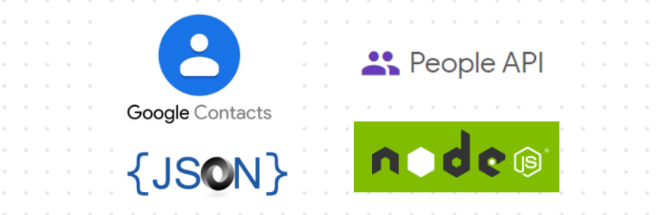

[](http://raajkhan.com/)

## Technologies


## About

Google Contacts API allows client applications to view and update user contacts. Contacts are stored in the Google Account. 

Please notice that the good functionality of this API depends on Google's willing to keep the backward compatibility.
If this happens, feel free to contribute or open an issue

To follow this repo you can export your Google contacts into a JSON file.


## Beginners Guide

If you are a total beginner to this, start here!

1. Go to this url: https://developers.google.com/people/quickstart/nodejs or follow this,
2. Complete the steps described in the rest of this page to create a simple Node.js command-line application that makes requests to the People API.

## Prerequisites
To run this quickstart, you need the following prerequisites:

* **Node.js** & **npm** installed.
* A **Google account**

## Step 1: Turn on the People API
Click **Enable the People API** button to create a new Cloud Platform project and automatically enable the People API. or simply follow the steps:-

1. Enter a new project name or use default name, I prefere default name;
2. Click **Next**;
3. Select Webserver or Desktop App (Prefer: Web Server)
4. Pass a redirect url;
5. In resulting dialog click **DOWNLOAD CLIENT CONFIGURATION** and save the file credentials.json to your working directory.


## Step 2: Install the client library
Run the following commands to install the libraries using npm:


```
npm install googleapis@39 --save
```

## Step 3: Set up the sample

Create a file named index.js in your working directory and copy in the following code:

```javascript
const fs = require('fs');
const readline = require('readline');
const {google} = require('googleapis');

// If modifying these scopes, delete token.json.
const SCOPES = ['https://www.googleapis.com/auth/contacts.readonly'];
// The file token.json stores the user's access and refresh tokens, and is
// created automatically when the authorization flow completes for the first
// time.
const TOKEN_PATH = 'token.json';

// Load client secrets from a local file.
fs.readFile('credentials.json', (err, content) => {
  if (err) return console.log('Error loading client secret file:', err);
  // Authorize a client with credentials, then call the Google Tasks API.
  authorize(JSON.parse(content), listConnectionNames);
});

/**
 * Create an OAuth2 client with the given credentials, and then execute the
 * given callback function.
 * @param {Object} credentials The authorization client credentials.
 * @param {function} callback The callback to call with the authorized client.
 */
function authorize(credentials, callback) {
  const {client_secret, client_id, redirect_uris} = credentials.installed;
  const oAuth2Client = new google.auth.OAuth2(
      client_id, client_secret, redirect_uris[0]);

  // Check if we have previously stored a token.
  fs.readFile(TOKEN_PATH, (err, token) => {
    if (err) return getNewToken(oAuth2Client, callback);
    oAuth2Client.setCredentials(JSON.parse(token));
    callback(oAuth2Client);
  });
}

/**
 * Get and store new token after prompting for user authorization, and then
 * execute the given callback with the authorized OAuth2 client.
 * @param {google.auth.OAuth2} oAuth2Client The OAuth2 client to get token for.
 * @param {getEventsCallback} callback The callback for the authorized client.
 */
function getNewToken(oAuth2Client, callback) {
  const authUrl = oAuth2Client.generateAuthUrl({
    access_type: 'offline',
    scope: SCOPES,
  });
  console.log('Authorize this app by visiting this url:', authUrl);
  const rl = readline.createInterface({
    input: process.stdin,
    output: process.stdout,
  });
  rl.question('Enter the code from that page here: ', (code) => {
    rl.close();
    oAuth2Client.getToken(code, (err, token) => {
      if (err) return console.error('Error retrieving access token', err);
      oAuth2Client.setCredentials(token);
      // Store the token to disk for later program executions
      fs.writeFile(TOKEN_PATH, JSON.stringify(token), (err) => {
        if (err) return console.error(err);
        console.log('Token stored to', TOKEN_PATH);
      });
      callback(oAuth2Client);
    });
  });
}

/**
 * Print the display name if available for 10 connections.
 *
 * @param {google.auth.OAuth2} auth An authorized OAuth2 client.
 */
function listConnectionNames(auth) {
  const service = google.people({version: 'v1', auth});
  service.people.connections.list({
    resourceName: 'people/me',
    pageSize: 10,
    personFields: 'names,emailAddresses',
  }, (err, res) => {
    if (err) return console.error('The API returned an error: ' + err);
    const connections = res.data.connections;
    if (connections) {
      console.log('Connections:');
      connections.forEach((person) => {
        if (person.names && person.names.length > 0) {
          console.log(person.names[0].displayName);
        } else {
          console.log('No display name found for connection.');
        }
      });
    } else {
      console.log('No connections found.');
    }
  });
}
```

## Step 4: Change your credentials.json file
Go to **credentials.json** file see the initial line of this file, replace **web** by **installed** or you will get a error.

## Step 5: Run the sample
Run the sample using the following command:
```
node . or, node index.js
```
The first time you run the sample, it will prompt you to authorize access:

1. Browse to the provided URL in your web browser.
    
    If you are not already logged into your **Google account**, you will be prompted to log in. If you are logged into **multiple Google accounts**, you will be asked to **select one account** to use for the **authorization**.

    If you don't have a browser on the machine running the code, and you've selected "Desktop app" when creating the OAuth client, you can browse to the URL provided on another machine, and then copy the authorization code back to the running sample.
    
    
2.  Click the Accept/Allow button.
3.  Copy the code you're given, paste it into the command-line prompt, and press Enter.

    If you do not see any **Code** then check the browser url where you can see the a parameter called **code='something'** copy the code nefore **&** sign, because that was another parameter.
    
    After this The file **token.json** stores the user's access and refresh tokens, and is created automatically when the authorization flow completes for the first time.Load previously authorized token from a file, if it exists.
    
4. **Paste** the **code** where asked in your terminal. You will see a result printed in your terminal which is Contacts Name & Emails for **10** contacts by **default**.

5. Now copy the **main.js** code into your **index.js** file.

6. You're all set, enjoy :rocket:

### License
This project is licensed under [GLWTPL](https://github.com/me-shaon/GLWTPL/blob/master/LICENSE)
   
